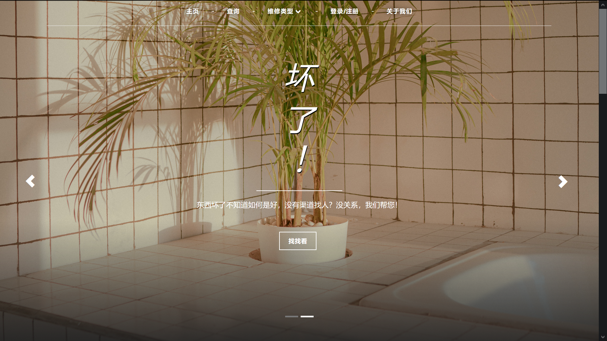
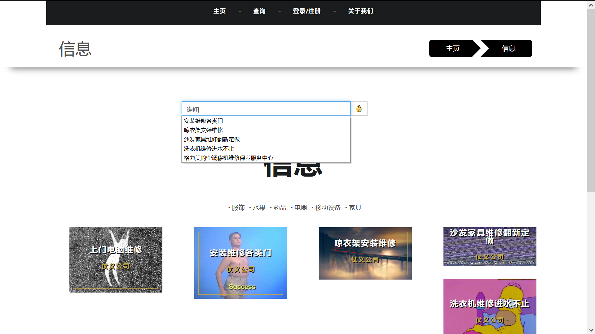
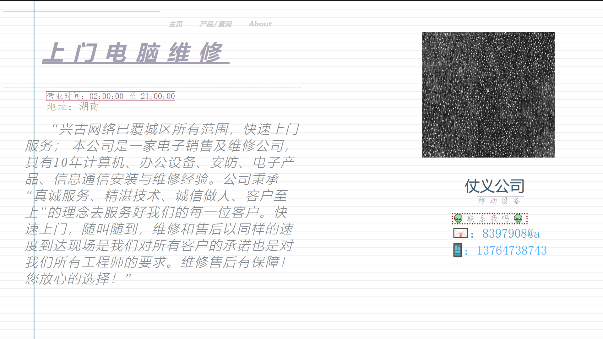
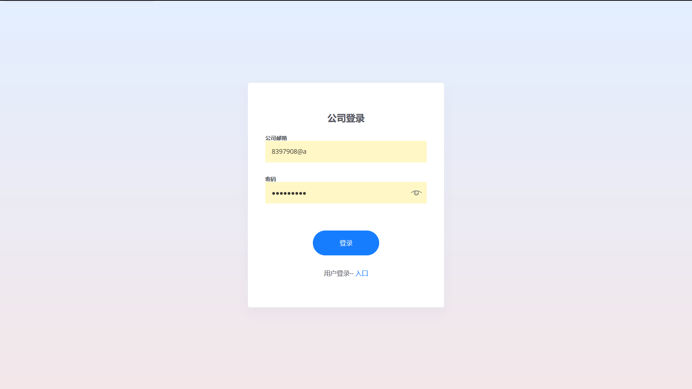
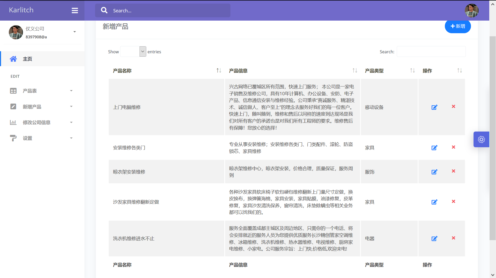
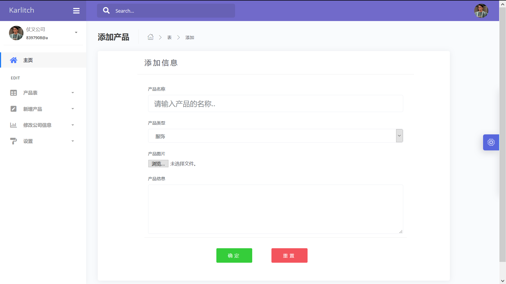
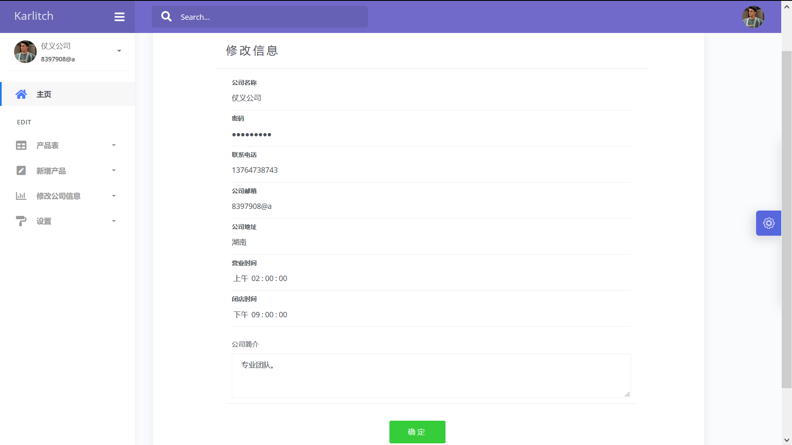

<h1>简易的 java维修信息服务平台</h1>

Java后台框架：Spring、SpringMVC、Mybatis

前端框架：Bootstrap、Jquery

数据库：MySQL

部署：Tomca
 
 

<h6>只完成了一小部分内容，其他功能还需后续继续完善。</h6>
 
🎣网站首页

 
查询页面

通过Ajax与json实现预加载功能。
 
 
商品详情页面

 
登录页面：通过后台数据库的账号密码进行登录

 
后台管理首页

 
产品表展示：可以在此页面上进行修改和删除；分页和搜索通过前端代码实现。

 
新增产品页面

 
修改公司信息页面

 

